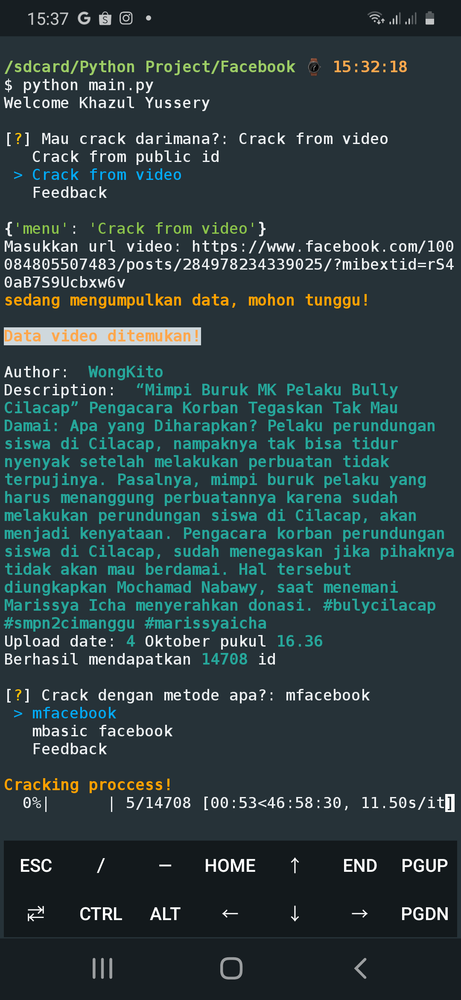

# Facebook Premium

* [Menginstall Termux](#menginstall-termux)
* [Install Package](#install-package)
* [Menjalankan Program](#menjalanlan-program)
* [Output](#output)
* [Kontak Author](#contact)

### Menginstall Termux
Hal yang paling awal kita lakukan adalah mendownload aplikasi [Termux](https://f-droid.org/repo/com.termux_118.apk).

### Install Package
Ada beberapa package yang harus di install setelah itu.

Ketikan perintah ini pada termux.

```bash
$pkg install python -y
$pip install -r requirements.txt
```

### Menjalankan Program
Ketikan perintah ini untuk menjalankan program

```bash
$cd facebook_premium
```

Kemudian, ketikan


```bash
$python main.py
```

### Output
Ini adalah output dari program tersebut.



### Kontak Saya

* [WhatsApp](https://wa.me/qr/XN5QA2KBIRN7B1)
* [Instagram](https://www.instagram.com/khazulys)
